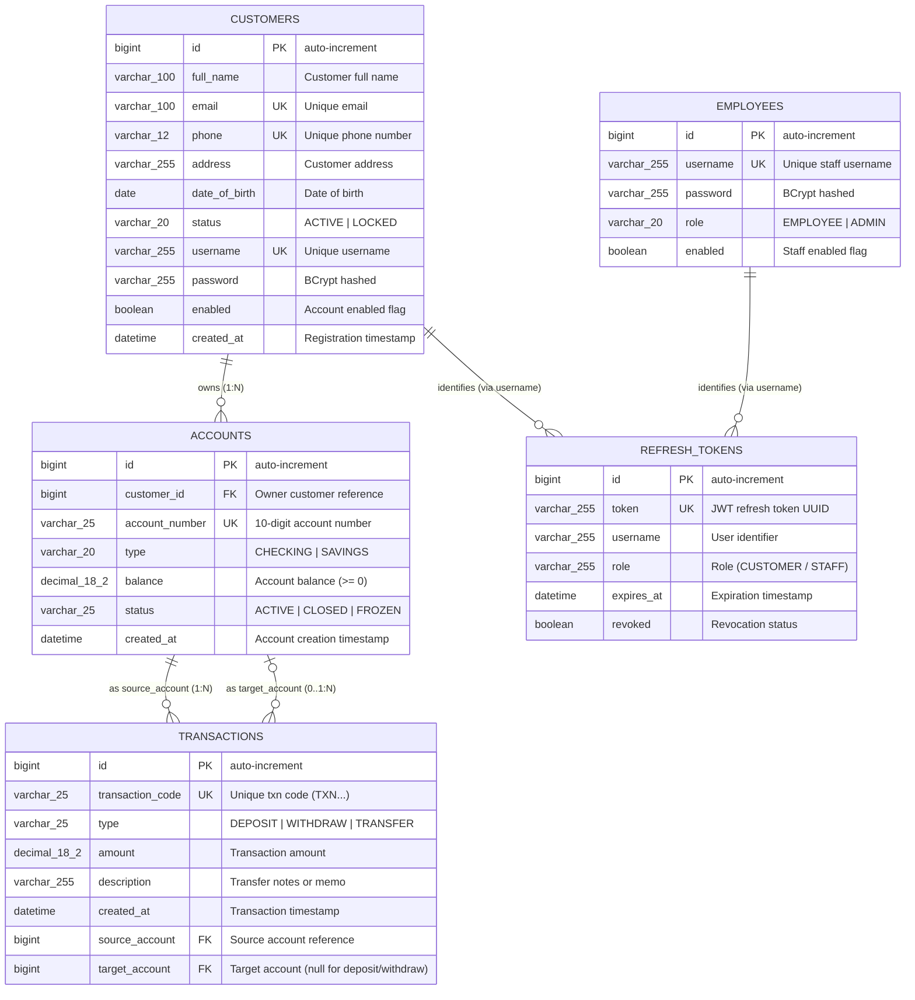
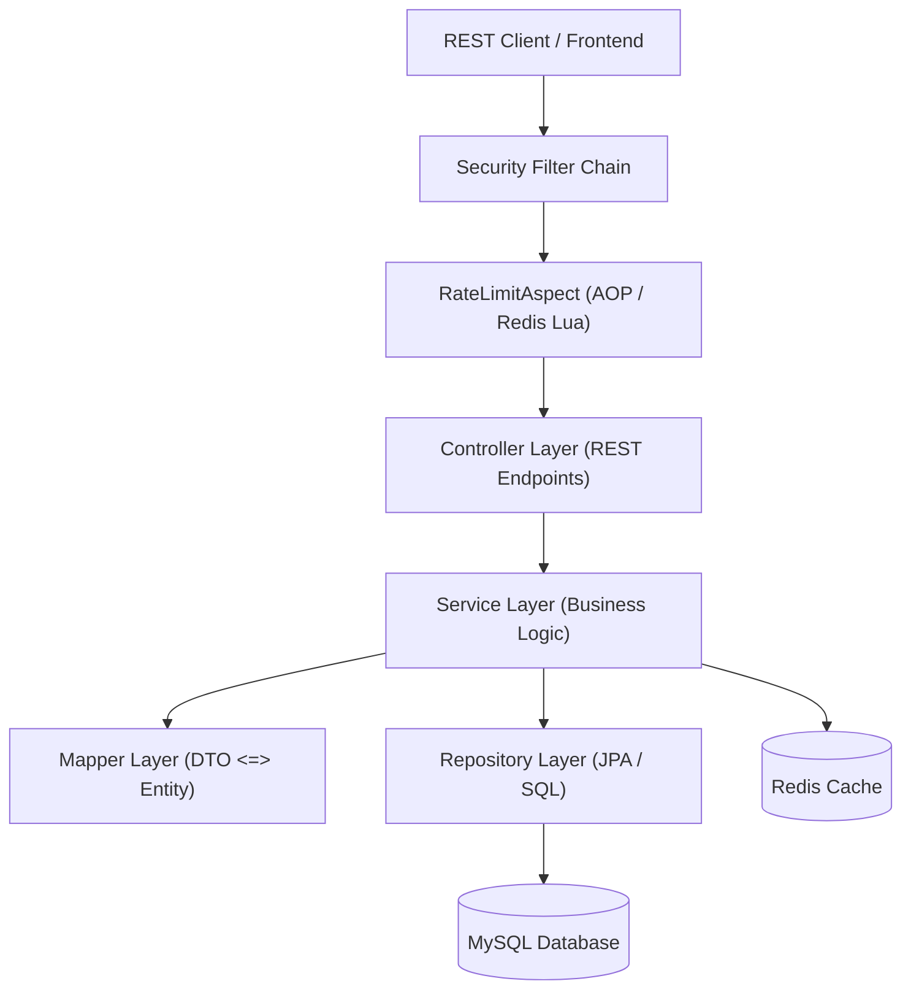

# SmartBank — Mini Banking System

SmartBank is a production-ready, secure, and containerized RESTful API for a Mini Banking System built with modern **Java Spring Boot 3.x**, **Spring Security 6**, **MySQL 8.0**, and **Redis 7.2**.

The system supports core banking operations such as customer profile management, account opening, deposits, withdrawals, internal transfers, and transaction logs. Under the hood, it incorporates advanced patterns like concurrency control (pessimistic locking to avoid race conditions), API rate limiting, and JWT Refresh Token Rotation.

---

## 🛠 Tech Stack & Design Patterns

### Technology Stack
| Technology / Library | Version | Description |
| :--- | :--- | :--- |
| **Java** | 21 | Modern LTS runtime offering top performance and virtual thread readiness. |
| **Spring Boot** | 3.4.4 | Core framework providing Dependency Injection (DI) and Auto-Configuration. |
| **Spring Security** | 6.x | Handles Role-Based Access Control (RBAC) and stateless JWT filter chains. |
| **Spring Data JPA** | 3.x | Object-Relational Mapping (ORM) powered by Hibernate 6. |
| **Spring Data Redis** | 3.x | Drives both data caching and API rate limiting. |
| **JJWT (Java JWT)** | 0.12.6 | Library used to sign, parse, and validate JSON Web Tokens. |
| **MySQL** | 8.0 | Relational database to persist accounts, transactions, and customers. |
| **Redis** | 7.2 | In-memory key-value store used for caching and rate limiting. |
| **MapStruct** | 1.6.3 | Compile-time code generator for type-safe DTO <=> Entity mapping. |
| **Lombok** | — | Annotation processor to eliminate boilerplate Java code. |
| **Docker / Compose** | — | Containerization for easy local deployment. |

### Entity Relationship Diagram (ERD)

The relational schema is designed with strict integrity constraints, composite indexes for high-throughput query performance, and clear entity boundaries:



### Architectural Highlights & Design Patterns

#### 1. Layered Architecture
The codebase strictly follows a **3-Layer Architecture** (Controller -> Service -> Repository / Mapper / Entity) to enforce clean separation of concerns:


#### 2. Concurrency & Deadlock Avoidance (Pessimistic Locking)
During bank transfers, concurrent transactions can easily lead to race conditions or deadlocks. SmartBank solves this by:
*   **Pessimistic Write Locks**: Utilizing JPA's `@Lock(LockModeType.PESSIMISTIC_WRITE)` to lock database rows for accounts during transactions (deposits, withdrawals, and transfers).
*   **Lock Ordering**: To prevent deadlocks when transferring funds between two accounts, the accounts are dynamically sorted alphabetically by account number. This guarantees that locks are always acquired in a consistent order, eliminating cyclic wait conditions.

#### 3. Custom AOP Rate Limiting
To protect endpoints from abuse (e.g., brute-force login attempts or transfer spamming), a custom `@RateLimit` annotation is available:
*   **Redis Lua Scripting**: Rate limits are enforced using atomic increments via a Lua script in Redis.
*   **Aspect-Oriented Programming (AOP)**: An Aspect intercepts requests to annotated methods, generating a rate-limiting key based on the client's IP address and requested URI.

#### 4. Stateless JWT & Refresh Token Rotation
Authentication is completely stateless using JSON Web Tokens:
*   **Short-lived Access Tokens**: Minimizes the window of opportunity for stolen token misuse.
*   **Refresh Token Rotation (RTR)**: Long-lived refresh tokens are stored in the database. When a new access token is requested, the old refresh token is immediately revoked, and a new refresh token is issued. This detects and mitigates replay attacks.

---

## 📁 Project Directory Layout

```text 
src/main/java/com/SmartBank/
├── config/                  # App configurations (SecurityConfig, RedisConfig)
├── controller/              # REST Endpoints (Presentation layer)
│   └── v1/                  # API Version 1 Controllers (Account, Auth, Customer, Transaction)
├── dto/                     # Request and Response Data Transfer Objects
│   ├── request/             # Incoming request DTOs with validation rules (@Valid)
│   └── response/            # Unified ApiResponse<T>, PageResponse<T>, and Domain DTOs
├── entity/                  # JPA Entities (Database Models with composite indexes)
│   └── enums/               # Enums like Role, TransactionType, AccountStatus
├── exception/               # Centralized Global Exception Handler (@RestControllerAdvice) & AppException
├── mapper/                  # MapStruct compile-time DTO <=> Entity mappers
├── repository/              # Spring Data JPA Repository interfaces (with Lock & Pagination)
├── security/                # JWT filters, Custom EntryPoints, and AOP Rate Limiting
│   ├── ratelimit/           # Custom @RateLimit annotation & Redis Lua script aspect
│   └── handler/             # Custom AuthenticationEntryPoint (401) & AccessDeniedHandler (403)
└── service/                 # Core Business Service Interfaces (Dependency Inversion)
    └── impl/                # Service Implementations (Transactional & Redis Caching)
```

---

## ⚙️ Quick Start & Local Setup

### Prerequisites
Make sure you have the following installed on your machine:
*   [JDK 21](https://adoptium.net/)
*   [Docker & Docker Compose](https://www.docker.com/products/docker-desktop/)
*   [Maven](https://maven.apache.org/) (optional, as the Maven Wrapper `./mvnw` is included)

### Step 1: Clone and Navigate
Clone the repository to your local machine:
```bash
git clone <repository_url>
cd SmartBank
```

### Step 2: Configure Environment Variables (`.env`)
Create a `.env` file at the root of the project with the following properties:
```properties
# Database Configuration
DB_URL=jdbc:mysql://mysql:3306/SmartBank?useSSL=false&serverTimezone=UTC&allowPublicKeyRetrieval=true&createDatabaseIfNotExist=true
DB_USERNAME=root
DB_PASSWORD=ducnhat12a1

# Redis Configuration
REDIS_HOST=redis
REDIS_PORT=6379
REDIS_PASSWORD=NguyenLeDucNhat
REDIS_TIMEOUT=2000ms

# JPA / Hibernate Setup
JPA_DDL_AUTO=update
JPA_SHOW_SQL=false

# Caching Configuration
CACHE_TTL=10m

# JWT Configuration
JWT_SECRET=nguyenleducnhat182006fithcmusspringbootsecurity
JWT_EXPIRATION=900000          # 15 Minutes (in milliseconds)
JWT_REFRESH_EXPIRATION=604800000 # 7 Days (in milliseconds)
```

> [!NOTE]
> The database connection string contains `createDatabaseIfNotExist=true` so that MySQL automatically creates the `SmartBank` schema on its first connection.

### Step 3: Run the Application

You can spin up the application in two ways:

#### Option A: Run Everything inside Docker Containers (Recommended)
This approach launches MySQL, Redis, and the Spring Boot application fully containerized and connected over a secure Docker network.

1.  Start all services using Docker Compose:
    ```bash
    docker compose up --build
    ```
2.  The application will be accessible at: `http://localhost:8080`

#### Option B: Run Database & Cache in Docker, Application Locally (Hybrid / Dev Mode)
This is the standard approach for active development, allowing you to run the Java app from your terminal or favorite IDE.

1.  Launch only MySQL and Redis in the background:
    ```bash
    docker compose up -d mysql redis
    ```
    *(Note: MySQL is mapped to port `3307` on your host machine to prevent conflicts with any local MySQL running on `3306`)*

2.  Update your `.env` file to redirect connections to your local host:
    ```properties
    # For local JVM execution, connect to host-mapped ports
    DB_URL=jdbc:mysql://localhost:3307/SmartBank?useSSL=false&serverTimezone=UTC&allowPublicKeyRetrieval=true&createDatabaseIfNotExist=true
    REDIS_HOST=localhost
    ```

3.  Build and run the Spring Boot app:
    ```bash
    # On Windows (PowerShell)
    ./mvnw.cmd spring-boot:run

    # On macOS / Linux
    ./mvnw spring-boot:run
    ```

---

## 🔒 Authentication & Authorization

All secure endpoints require the client to supply a JSON Web Token (JWT) in the HTTP headers:
```http
Authorization: Bearer <your_access_token>
```

### Role-Based Access Control (RBAC)
*   `CUSTOMER`: Allowed to manage self-service accounts (`/api/v1/accounts/my`) and perform transactions like deposit, withdraw, or transfer (`/api/v1/transactions/**`).
*   `EMPLOYEE`: Allowed to inspect customer accounts, view transaction logs, and freeze/close accounts.
*   `ADMIN`: Has full administrative control over accounts, customer profiles, and system employees.

---

## 📖 Core API Endpoints

### 1. Authentication Endpoints
*Controller code:* [AuthController.java](file:///f:/SmartBank_Project/SmartBank/src/main/java/com/SmartBank/controller/v1/AuthController.java)

#### Customer Self-Registration
*   **Endpoint**: `POST /auth/register`
*   **Access**: Public
*   **Request Payload** ([RegisterRequest.java](file:///d:/SmartBank_Project/SmartBank/src/main/java/com/SmartBank/dto/request/RegisterRequest.java)):
    ```json
    {
      "username": "nguyen_nhat",
      "email": "nhat.nguyen@example.com",
      "password": "SecurePassword123"
    }
    ```
*   **Response Payload**:
    ```json
    {
      "message": "Register successful"
    }
    ```

#### Login (Employee & Customer)
*   **Endpoint**: `POST /auth/login`
*   **Access**: Public
*   **Request Payload** ([LoginRequest.java](file:///d:/SmartBank_Project/SmartBank/src/main/java/com/SmartBank/dto/request/LoginRequest.java)):
    ```json
    {
      "username": "nguyen_nhat",
      "password": "SecurePassword123"
    }
    ```
*   **Response Payload** ([LoginResponse.java](file:///d:/SmartBank_Project/SmartBank/src/main/java/com/SmartBank/dto/response/LoginResponse.java)):
    ```json
    {
      "accessToken": "eyJhbGciOiJIUzI1NiJ9.eyJzdWIiOiJuZ3V5ZW5fbmhhdCIs...",
      "refreshToken": "7c9e6679-7425-40de-944b-e07fc1f90ae7",
      "username": "nguyen_nhat",
      "role": "CUSTOMER"
    }
    ```

#### Refresh Access Token (Refresh Token Rotation)
*   **Endpoint**: `POST /auth/refresh`
*   **Access**: Public
*   **Request Payload** ([RefreshRequest.java](file:///d:/SmartBank_Project/SmartBank/src/main/java/com/SmartBank/dto/request/RefreshRequest.java)):
    ```json
    {
      "refreshToken": "7c9e6679-7425-40de-944b-e07fc1f90ae7"
    }
    ```
*   **Response Payload** ([LoginResponse.java](file:///d:/SmartBank_Project/SmartBank/src/main/java/com/SmartBank/dto/response/LoginResponse.java)):
    ```json
    {
      "accessToken": "eyJhbGciOiJIUzI1NiJ9.new_jwt_content...",
      "refreshToken": "550e8400-e29b-41d4-a716-446655440000",
      "username": "nguyen_nhat",
      "role": "CUSTOMER"
    }
    ```
    *(Note: The old refresh token is marked as revoked immediately upon use to prevent replay attacks.)*

#### Logout
*   **Endpoint**: `POST /api/auth/logout`
*   **Access**: Authenticated users
*   **Response Payload**:
    ```json
    {
      "message": "Logout successful"
    }
    ```

---

### 2. Administrator & Employee Management Endpoints
*Controller code:* [AuthController.java](file:///f:/SmartBank_Project/SmartBank/src/main/java/com/SmartBank/controller/v1/AuthController.java)

#### Create System Employee/Admin
*   **Endpoint**: `POST /admin/employees`
*   **Access**: `ADMIN`
*   **Request Payload** ([CreateEmployeeRequest.java](file:///d:/SmartBank_Project/SmartBank/src/main/java/com/SmartBank/dto/request/CreateEmployeeRequest.java)):
    ```json
    {
      "username": "staff_member",
      "password": "StaffPassword123",
      "role": "EMPLOYEE"
    }
    ```
    *(Supported roles: `EMPLOYEE`, `ADMIN`)*
*   **Response**: `201 Created` (No response body)

---

### 3. Customer Profile Management Endpoints
*Controller code:* [CustomerController.java](file:///f:/SmartBank_Project/SmartBank/src/main/java/com/SmartBank/controller/v1/CustomerController.java)

> **Note**: These endpoints are utilized by administrators to manage customer profile details.

#### Create Customer Profile
*   **Endpoint**: `POST /api/v1/customers`
*   **Access**: `ADMIN`
*   **Request Payload** ([CustomerRequest.java](file:///d:/SmartBank_Project/SmartBank/src/main/java/com/SmartBank/dto/request/CustomerRequest.java)):
    ```json
    {
      "fullName": "Nguyen Nhat",
      "email": "nhat.nguyen@example.com",
      "phone": "0987654321",
      "address": "123 Le Loi Street, District 1, HCMC",
      "dateOfBirth": "1995-10-15"
    }
    ```
*   **Response Payload** ([CustomerResponse.java](file:///d:/SmartBank_Project/SmartBank/src/main/java/com/SmartBank/dto/response/CustomerResponse.java)):
    ```json
    {
      "id": 1,
      "fullName": "Nguyen Nhat",
      "email": "nhat.nguyen@example.com",
      "phone": "0987654321",
      "address": "123 Le Loi Street, District 1, HCMC",
      "dateOfBirth": "1995-10-15",
      "status": "ACTIVE",
      "createdAt": "2026-05-21T15:00:00",
      "totalAccounts": 0
    }
    ```

#### Update Customer Profile
*   **Endpoint**: `PUT /api/v1/customers/{id}`
*   **Access**: `ADMIN`
*   **Request Payload** ([CustomerRequest.java](file:///d:/SmartBank_Project/SmartBank/src/main/java/com/SmartBank/dto/request/CustomerRequest.java)):
    ```json
    {
      "fullName": "Nguyen Nhat (Updated)",
      "email": "nhat.nguyen.new@example.com",
      "phone": "0987654321",
      "address": "456 Nguyen Hue Street, District 1, HCMC",
      "dateOfBirth": "1995-10-15"
    }
    ```
*   **Response Payload** ([CustomerResponse.java](file:///d:/SmartBank_Project/SmartBank/src/main/java/com/SmartBank/dto/response/CustomerResponse.java)):
    ```json
    {
      "id": 1,
      "fullName": "Nguyen Nhat (Updated)",
      "email": "nhat.nguyen.new@example.com",
      "phone": "0987654321",
      "address": "456 Nguyen Hue Street, District 1, HCMC",
      "dateOfBirth": "1995-10-15",
      "status": "ACTIVE",
      "createdAt": "2026-05-21T15:00:00",
      "totalAccounts": 1
    }
    ```

#### Delete Customer Profile (Soft Delete)
*   **Endpoint**: `DELETE /api/v1/customers/{id}`
*   **Access**: `ADMIN`
*   **Response**: `204 No Content` (The customer's status is toggled to `LOCKED` in the database).

---

### 4. Account Management Endpoints
*Controller code:* [AccountController.java](file:///f:/SmartBank_Project/SmartBank/src/main/java/com/SmartBank/controller/v1/AccountController.java)

#### Create a Personal Bank Account
*   **Endpoint**: `POST /api/v1/accounts/my`
*   **Access**: `CUSTOMER`
*   **Request Payload** ([AccountCreateRequest.java](file:///d:/SmartBank_Project/SmartBank/src/main/java/com/SmartBank/dto/request/AccountCreateRequest.java)):
    ```json
    {
      "customerId": 1,
      "type": "CHECKING"
    }
    ```
    *(Supported account types: `SAVINGS`, `CHECKING`)*
*   **Response Payload** ([AccountResponse.java](file:///d:/SmartBank_Project/SmartBank/src/main/java/com/SmartBank/dto/response/AccountResponse.java)):
    ```json
    {
      "id": 12,
      "accountNumber": "1537284903",
      "type": "CHECKING",
      "balance": 0.0,
      "status": "ACTIVE",
      "createdAt": "2026-05-21T15:05:00",
      "customerId": 1,
      "customerName": "Nguyen Nhat"
    }
    ```

#### Get List of My Accounts
*   **Endpoint**: `GET /api/v1/accounts/my`
*   **Access**: `CUSTOMER`
*   **Response Payload**:
    ```json
    [
      {
        "id": 12,
        "accountNumber": "1537284903",
        "type": "CHECKING",
        "balance": 1500000.0,
        "status": "ACTIVE",
        "createdAt": "2026-05-21T15:05:00",
        "customerId": 1,
        "customerName": "Nguyen Nhat"
      }
    ]
    ```

#### Freeze Bank Account
*   **Endpoint**: `PATCH /api/v1/accounts/{id}/freeze`
*   **Access**: `EMPLOYEE` or `ADMIN`
*   **Response Payload** ([AccountResponse.java](file:///d:/SmartBank_Project/SmartBank/src/main/java/com/SmartBank/dto/response/AccountResponse.java)):
    ```json
    {
      "id": 12,
      "accountNumber": "1537284903",
      "type": "CHECKING",
      "balance": 1500000.0,
      "status": "FROZEN",
      "createdAt": "2026-05-21T15:05:00",
      "customerId": 1,
      "customerName": "Nguyen Nhat"
    }
    ```

---

### 5. Transaction Endpoints
*Controller code:* [TransactionController.java](file:///f:/SmartBank_Project/SmartBank/src/main/java/com/SmartBank/controller/v1/TransactionController.java)

#### Deposit Funds
*   **Endpoint**: `POST /api/v1/transactions/deposit`
*   **Access**: `CUSTOMER`, `EMPLOYEE`, or `ADMIN`
*   **Request Payload** ([DepositWithDrawRequest.java](file:///d:/SmartBank_Project/SmartBank/src/main/java/com/SmartBank/dto/request/DepositWithDrawRequest.java)):
    ```json
    {
      "accountNumber": "1537284903",
      "amount": 500000,
      "description": "Cash deposit at counter"
    }
    ```
    *(Note: Minimum deposit is 1,000 VNĐ, maximum is 500,000,000 VNĐ per transaction).*
*   **Response Payload** ([TransactionResponse.java](file:///d:/SmartBank_Project/SmartBank/src/main/java/com/SmartBank/dto/response/TransactionResponse.java)):
    ```json
    {
      "id": 101,
      "transactionCode": "TXN1716283948293",
      "type": "DEPOSIT",
      "amount": 500000,
      "description": "Cash deposit at counter",
      "createdAt": "2026-05-21T15:10:00",
      "sourceAccountNumber": "1537284903",
      "targetAccountNumber": null
    }
    ```

#### Withdraw Funds
*   **Endpoint**: `POST /api/v1/transactions/withdraw`
*   **Access**: `CUSTOMER`, `EMPLOYEE`, or `ADMIN`
*   **Request Payload** ([DepositWithDrawRequest.java](file:///d:/SmartBank_Project/SmartBank/src/main/java/com/SmartBank/dto/request/DepositWithDrawRequest.java)):
    ```json
    {
      "accountNumber": "1537284903",
      "amount": 200000,
      "description": "Cash withdrawal at ATM"
    }
    ```
*   **Response Payload** ([TransactionResponse.java](file:///d:/SmartBank_Project/SmartBank/src/main/java/com/SmartBank/dto/response/TransactionResponse.java)):
    ```json
    {
      "id": 102,
      "transactionCode": "TXN1716283959182",
      "type": "WITHDRAW",
      "amount": 200000,
      "description": "Cash withdrawal at ATM",
      "createdAt": "2026-05-21T15:12:00",
      "sourceAccountNumber": "1537284903",
      "targetAccountNumber": null
    }
    ```

#### Internal Account Transfer
*   **Endpoint**: `POST /api/v1/transactions/transfer`
*   **Access**: `CUSTOMER`, `EMPLOYEE`, or `ADMIN`
*   **Request Payload** ([TransferRequest.java](file:///d:/SmartBank_Project/SmartBank/src/main/java/com/SmartBank/dto/request/TransferRequest.java)):
    ```json
    {
      "sourceAccountNumber": "1537284903",
      "targetAccountNumber": "9876543210",
      "amount": 100000,
      "description": "Fund transfer for lunch payment"
    }
    ```
*   **Response Payload** ([TransactionResponse.java](file:///d:/SmartBank_Project/SmartBank/src/main/java/com/SmartBank/dto/response/TransactionResponse.java)):
    ```json
    {
      "id": 103,
      "transactionCode": "TXN1716283969234",
      "type": "TRANSFER",
      "amount": 100000,
      "description": "Fund transfer for lunch payment",
      "createdAt": "2026-05-21T15:15:00",
      "sourceAccountNumber": "1537284903",
      "targetAccountNumber": "9876543210"
    }
    ```

#### Get Account Bank Statement (Paginated & Sorted)
*   **Endpoint**: `GET /api/v1/transactions/account/{accountNumber}?page=0&size=10`
*   **Access**: `EMPLOYEE`, `ADMIN`, or account owner (`CUSTOMER`) via `@accountSecurity.isOwnerByAccountNumber`
*   **Query Parameters**:
    *   `page`: Zero-based page index (default: `0`)
    *   `size`: Number of transaction records per page (default: `10`)
*   **Response Payload** ([ApiResponse.java](file:///f:/SmartBank_Project/SmartBank/src/main/java/com/SmartBank/dto/response/ApiResponse.java) wrapping [PageResponse.java](file:///f:/SmartBank_Project/SmartBank/src/main/java/com/SmartBank/dto/response/PageResponse.java)):
    ```json
    {
      "code": 200,
      "message": "Get account statement successfully",
      "data": {
        "content": [
          {
            "id": 103,
            "transactionCode": "TXN1716283969234",
            "type": "TRANSFER",
            "amount": 100000,
            "description": "Fund transfer for lunch payment",
            "createdAt": "2026-05-21T15:15:00",
            "sourceAccountNumber": "1537284903",
            "targetAccountNumber": "9876543210"
          }
        ],
        "pageNo": 0,
        "pageSize": 10,
        "totalElements": 1,
        "totalPages": 1,
        "last": true
      },
      "timestamp": "2026-05-21T15:16:00"
    }
    ```

---

## ⚠️ Global Exception Handling

In case of errors, the application returns a unified JSON error payload. The specific error codes are cataloged in [ErrorCode.java](file:///d:/SmartBank_Project/SmartBank/src/main/java/com/SmartBank/exception/ErrorCode.java).

#### Error Response Format ([ErrorResponse.java](file:///d:/SmartBank_Project/SmartBank/src/main/java/com/SmartBank/exception/ErrorResponse.java)):
```json
{
  "code": 1402,
  "message": "Account is inactive",
  "path": "/api/v1/transactions/withdraw",
  "timestamp": "2026-05-21T15:18:24.123"
}
```

#### Common Error Codes:
*   `1002`: Unauthorized (Invalid or expired token)
*   `1100`: Username already exists (The login username is taken)
*   `1200`: Customer not found (The specified customer profile ID does not exist)
*   `1400`: Account not found (The account number does not exist)
*   `1402`: Account is inactive (The account is either frozen or closed)
*   `1501`: Invalid transaction amount (Insufficient balance or out of allowed transaction limits)
*   `1504`: Too many requests (Rate limit exceeded)

---

## 🧪 Testing & Verification

### 1. Run Automated Tests
Execute the JUnit test suite (unit and integration tests) using the Maven wrapper:
```bash
# On Windows (PowerShell)
./mvnw.cmd test

# On macOS / Linux
./mvnw test
```

### 2. Verify API Operations via CLI
Once the application starts (port `8080`), you can quickly verify it by running a register and login sequence using standard `curl` commands.

#### Register:
```bash
curl -X POST http://localhost:8080/auth/register \
  -H "Content-Type: application/json" \
  -d '{"username": "test_user", "email": "test.user@example.com", "password": "SecurePassword123"}'
```

#### Login:
```bash
curl -X POST http://localhost:8080/auth/login \
  -H "Content-Type: application/json" \
  -d '{"username": "test_user", "password": "SecurePassword123"}'
```

Copy the returned `accessToken` and pass it in subsequent authenticated requests using the header `Authorization: Bearer <your_access_token>`.
