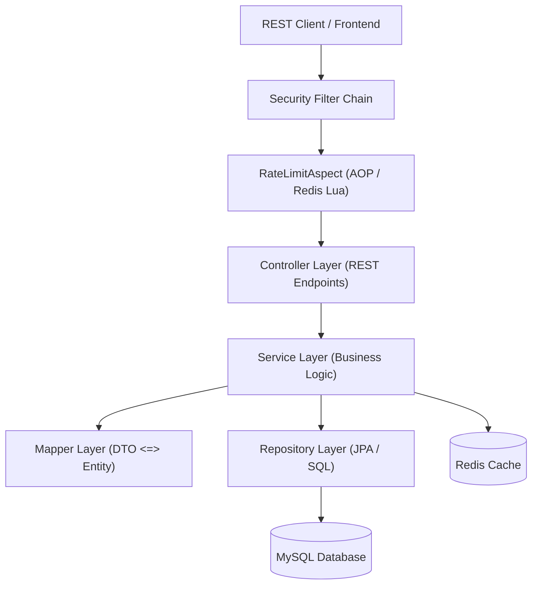

# SmartBank — Project Overview & Onboarding Guide

Welcome to **SmartBank**, a secure, high-performance, and containerized RESTful API representing a Mini Banking System. This document is a comprehensive guide designed for developers and users who clone this repository to explore, run, and contribute to the project.

---

## 🚀 Architectural Features & Design Patterns

SmartBank is designed following enterprise-grade architecture patterns to ensure concurrency control, high availability, and API security.

### 1. Concurrency & Deadlock Avoidance (Pessimistic Locking)
During bank transfers, concurrent transactions can easily lead to race conditions or deadlocks. SmartBank solves this by:
*   **Pessimistic Write Locks**: Utilizing JPA's `@Lock(LockModeType.PESSIMISTIC_WRITE)` to lock database rows for accounts during transactions (deposits, withdrawals, and transfers).
*   **Lock Ordering**: To prevent deadlocks when transferring funds between two accounts, the accounts are dynamically sorted alphabetically by account number. This guarantees that locks are always acquired in a consistent order, eliminating cyclic wait conditions.

### 2. Custom AOP Rate Limiting
To protect endpoints from abuse (e.g., brute-force login attempts or transfer spamming), a custom `@RateLimit` annotation is available:
*   **Redis Lua Scripting**: Rate limits are enforced using atomic increments via a Lua script in Redis.
*   **Aspect-Oriented Programming (AOP)**: An Aspect intercepts requests to annotated methods, generating a rate-limiting key based on the client's IP address and requested URI.

### 3. Stateless JWT & Refresh Token Rotation
Authentication is completely stateless using JSON Web Tokens:
*   **Short-lived Access Tokens**: Minimizes the window of opportunity for stolen token misuse.
*   **Refresh Token Rotation (RTR)**: Long-lived refresh tokens are stored in the database. When a new access token is requested, the old refresh token is immediately revoked, and a new refresh token is issued. This detects and mitigates replay attacks.

### 4. Layered Architecture
The codebase strictly follows a **3-Layer Architecture** to maintain clean separation of concerns:


---

## 🛠 Tech Stack & Core Libraries

| Technology / Library | Version | Description |
| :--- | :--- | :--- |
| **Java** | 21 | Modern LTS runtime offering top performance and features. |
| **Spring Boot** | 3.4.4 | The main framework providing DI, MVC, and Auto-Configuration. |
| **Spring Security** | 6.x | Handles RBAC (Customer, Employee, Admin) and stateless JWT filter chain. |
| **Spring Data JPA** | 3.x | Object-Relational Mapping (ORM) powered by Hibernate 6. |
| **Spring Data Redis** | 3.x | Drives both data caching and API rate limiting. |
| **JJWT (Java JWT)** | 0.12.6 | Library used to sign, parse, and validate JSON Web Tokens. |
| **MySQL** | 8.0 | Relational database to persist accounts, transactions, and customers. |
| **Redis** | 7.2 | In-memory key-value store used for cache and rate limiting. |
| **Lombok** | — | Annotation processor to eliminate boilerplate Java code. |
| **Docker / Compose** | — | Containerization for easy local deployment. |

---

## 📁 Project Directory Layout

```text
src/main/java/com/SmartBank/
├── config/                  # App configurations (Security, Redis Caching)
├── controller/              # REST Endpoints (Presentation layer)
├── dto/                     # Request and Response Data Transfer Objects
│   ├── request/
│   └── response/
├── entity/                  # JPA Entities (Database Models)
│   └── enums/               # Enums like Role, TransactionType, AccountStatus
├── exception/               # Centralized Global Exception Handler & Custom Errors
├── mapper/                  # MapStruct-like manual DTO-Entity conversions
├── repository/              # Spring Data JPA Repository interfaces
├── security/                # Security filters, Custom EntryPoints, and AOP Rate Limiting
│   ├── ratelimit/
│   └── handler/
└── service/                 # Core Business Logic implementation (Transactional)
```

---

## ⚙️ Quick Start & Local Setup

### Prerequisites
Make sure you have the following installed on your machine:
*   [JDK 21](https://adoptium.net/)
*   [Docker & Docker Compose](https://www.docker.com/products/docker-desktop/)
*   [Maven](https://maven.apache.org/) (optional, as the Maven Wrapper `./mvnw` is included)

---

### Step 1: Clone and Navigate
Clone the repository to your local machine and enter the project folder:
```bash
git clone <repository_url>
cd SmartBank
```

---

### Step 2: Environment Configuration (`.env`)
The application uses environment variables for configuration. A template is defined in the `.env` file. 

Create a `.env` file at the root of the project with the following properties:
```properties
# Database Configuration
DB_URL=jdbc:mysql://mysql:3306/SmartBank?useSSL=false&serverTimezone=UTC&allowPublicKeyRetrieval=true&createDatabaseIfNotExist=true
DB_USERNAME=root
DB_PASSWORD=ducnhat12a1

# Redis Configuration
REDIS_HOST=redis
REDIS_PORT=6379
REDIS_PASSWORD=NguyenLeDucNhat
REDIS_TIMEOUT=2000ms

# JPA / Hibernate Setup
JPA_DDL_AUTO=update
JPA_SHOW_SQL=false

# Caching Configuration
CACHE_TTL=10m

# JWT Configuration
JWT_SECRET=nguyenleducnhat182006fithcmusspringbootsecurity
JWT_EXPIRATION=900000          # 15 Minutes (in milliseconds)
JWT_REFRESH_EXPIRATION=604800000 # 7 Days (in milliseconds)
```

> [!NOTE]
> The database connection string contains `createDatabaseIfNotExist=true` so that MySQL automatically creates the `SmartBank` schema on its first connection.

---

### Step 3: Run the Application

You can spin up the application in two ways:

#### Option A: Run Everything inside Docker Containers (Recommended)
This approach launches MySQL, Redis, and the Spring Boot application fully containerized and connected over a secure Docker network.

1.  Start all services using Docker Compose:
    ```bash
    docker compose up --build
    ```
2.  The application will be accessible at: `http://localhost:8080`

#### Option B: Run Database & Cache in Docker, Application Locally (Hybrid / Dev Mode)
This is the standard approach for active development, allowing you to run the Java app from your terminal or favorite IDE.

1.  Launch only MySQL and Redis in the background:
    ```bash
    docker compose up -d mysql redis
    ```
    *(Note: MySQL is mapped to port `3307` on your host machine to prevent conflicts with any local MySQL running on `3306`)*

2.  Update your `.env` file to redirect connections to your local host:
    ```properties
    # For local JVM execution, connect to host-mapped ports
    DB_URL=jdbc:mysql://localhost:3307/SmartBank?useSSL=false&serverTimezone=UTC&allowPublicKeyRetrieval=true&createDatabaseIfNotExist=true
    REDIS_HOST=localhost
    ```

3.  Build and run the Spring Boot app using the Maven Wrapper:
    ```bash
    # On Windows (PowerShell)
    ./mvnw.cmd spring-boot:run

    # On macOS / Linux
    ./mvnw spring-boot:run
    ```

---

## 🧪 Testing & Verification

### 1. Run Automated Unit & Integration Tests
Run the test suite using the Maven wrapper:
```bash
./mvnw test
```

### 2. Verify API Operations
Once the application starts, you can verify it by executing a register and login sequence using a tool like Postman or `curl`.

#### Register a New Customer:
```bash
curl -X POST http://localhost:8080/auth/register \
  -H "Content-Type: application/json" \
  -d '{"username": "john_doe", "email": "john.doe@example.com", "password": "SecurePassword123"}'
```
*Expected Response (`200 OK`):*
```json
{
  "message": "Register successful"
}
```

#### Login to Acquire JWT:
```bash
curl -X POST http://localhost:8080/auth/login \
  -H "Content-Type: application/json" \
  -d '{"username": "john_doe", "password": "SecurePassword123"}'
```
*Expected Response (`200 OK`):*
```json
{
  "accessToken": "eyJhbGciOiJIUzI1NiJ9.eyJzdWIiOiJqb2huX2RvZSIs...",
  "refreshToken": "7c9e6679-7425-40de-944b-e07fc1f90ae7",
  "username": "john_doe",
  "role": "CUSTOMER"
}
```

Use the returned `accessToken` inside the `Authorization` header (`Bearer <token>`) to access protected endpoints.

---

## 📖 API Documentation
For a full list of REST endpoints, required request structures, and JSON payloads (Customer Registration, Account Opening, Deposits, Withdrawals, Internal Transfers, and Exception models), please refer to the detailed [README.md](file:///d:/SmartBank_Project/SmartBank/README.md) file.
