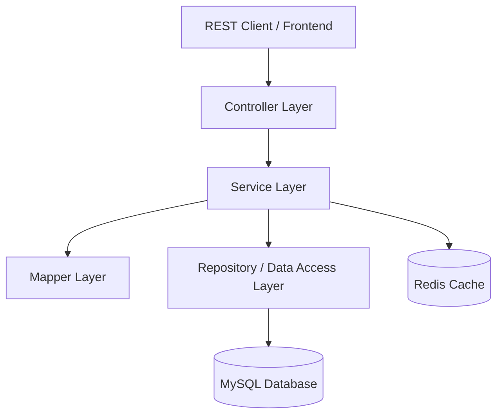

# SmartBank Engineering & Architectural Review

This document provides a deep, professional code and architectural review of the **SmartBank** project. The analysis is performed from the perspective of a Tech Lead / Senior Software Engineer, focusing on the standards expected for a Java Backend position.

---

## 1. Project Overview

### Purpose & Business Domain
**SmartBank** is a banking simulator API. It aims to solve the domain problem of managing customers, checking/savings accounts, and performing safe core banking transactions (deposits, withdrawals, and bank transfers).

### Core Functionalities
- **User & Role Authentication:** Registration, login, JWT access tokens, and Refresh Token Rotation (RTR).
- **Customer Directory:** CRUD operations on customer profiles.
- **Account Management:** Creating accounts, retrieving balances, freezing, and closing accounts.
- **Transactions Engine:** Deposit, withdraw, and transfer funds between accounts with basic validation constraints.
- **System Hardening:** Redis-based caching to improve read performance and AOP-based rate limiting on sensitive auth/transaction endpoints.

---

## 2. Architecture & Design

### Architectural Style
The project follows a standard **Layered / Three-Tier Architecture** (Controller -> Service -> Repository), utilizing Spring Boot MVC.



### Folder/Package Structure
The package structure is **packaged-by-layer**:
```text
com.SmartBank
├── config        # Configurations (Security, Redis)
├── controller    # REST Endpoints
├── dto           # Requests/Responses (separation of concerns)
├── entity        # JPA Entities & Enums
├── exception     # Custom Exception Handling & Handlers
├── mapper        # DTO <=> Entity Converters
├── repository    # Spring Data JPA Interfaces
├── security      # JWT Filters, Rate Limiting Aspects
└── service       # Core Business Logic
```

### Strengths
- **Clear Separation of Concerns:** Entities are not exposed directly to the REST API; the codebase enforces Request/Response DTOs and maps them using explicit mapper classes.
- **Clean Structure:** Follows standard Spring Boot project layout, making it very easy for any Java developer to navigate.

### Weaknesses
- **Domain-Leak in Enums:** The `ErrorCode` enum is placed inside `com.SmartBank.entity.enums`. Error codes explicitly carry HTTP statuses (`HttpStatus.BAD_REQUEST`, etc.). Placing API/HTTP concerns inside the persistence entity package violates clean separation of layers.
- **Tightly Coupled Services:** Services call other repositories directly (e.g., `AccountService` depends on `CustomerRepository` and `AccountRepository`). In a modular architecture, cross-domain communication should go through domain services or interfaces rather than direct repository coupling.

---

## 3. Code Quality Review

### Readability, Consistency & Organization
- Naming conventions conform to Java standards (PascalCase for classes, camelCase for variables/methods).
- Lombok is used effectively to reduce boilerplate code (`@Getter`, `@Setter`, `@Builder`).

### Critical Code Smells & Bugs

#### 1. Stale Cache and Non-Persisted Updates in `CustomerService`
Look at `CustomerService.update(Long id, CustomerRequest request)`:
```java
    @CachePut(value = "customers", key = "#id")
    public CustomerResponse update(Long id, CustomerRequest request) {
        Customer customer = repository.findById(id).orElse(null);
        if(customer == null) {
            throw new AppException(ErrorCode.CUSTOMER_NOT_FOUND);
        }

        customer.setFullName(request.getFullName());
        customer.setEmail(request.getEmail());
        customer.setPhone(request.getPhone());
        ...
        return customerMapper.toResponse(customer);
    }
```
> [!CAUTION]
> **No database save!** The method modifies the fields of the entity in memory but **never** calls `repository.save(customer)`, nor is the method annotated with `@Transactional`. 
> Consequently, the database is **never updated**. However, the `@CachePut` annotation eagerly caches the updated object in Redis! 
> This introduces a critical **Cache-DB Inconsistency**: the API will return the new data from the cache, but as soon as the cache expires or the server restarts, the database will revert to the old data.

#### 2. The Illusion of Soft Deleting in `CustomerService`
Look at `CustomerService.deleteById(Long id)`:
```java
        customer.setStatus(CustomerStatus.LOCKED);
        repository.deleteById(id);
```
> [!WARNING]
> The developer sets the customer's status to `CustomerStatus.LOCKED` (presumably for a soft delete or audit lock), but immediately calls `repository.deleteById(id)`. This physically deletes the row from the database! The status modification is completely useless.

#### 3. Broken SpEL Expression in `AccountController`
Look at `AccountController.getById(...)`:
```java
    @PreAuthorize("hasRole('ADMIN') or @accountSecurity.isOwner(#accountId, principal.username)")
    @GetMapping("/{id}")
    public ResponseEntity<AccountResponse> getById(@PathVariable Long id, Principal principal)
```
> [!CAUTION]
> There are two severe bugs on this single line:
> 1. There is **no bean** named `accountSecurity` defined in the entire application context! Calling this endpoint will throw a `NoSuchBeanDefinitionException` and crash the request.
> 2. The path variable is named `id`, but the SpEL expression references `#accountId`. Since Spring matches method parameters, SpEL will evaluate `#accountId` to `null` even if the bean existed.

#### 4. Missing Default Constructor in `RefreshToken` Entity
Look at `RefreshToken.java`:
```java
@Entity
@Getter
@Setter
@Builder
public class RefreshToken { ... }
```
> [!IMPORTANT]
> Because `@Builder` is present without `@NoArgsConstructor` and `@AllArgsConstructor`, Lombok removes the default implicit no-argument constructor. Hibernate **requires** a no-argument constructor to instantiate entities. Trying to read or write a `RefreshToken` will throw a runtime `InstantiationException` in production.

#### 5. Dead Code (Unused Variable) in `AuthService`
In `AuthService.login(...)`:
```java
        String token = jwtUtil.generateToken(username, role); // Generated and completely ignored!
        String accessToken = jwtUtil.generateToken(username, role);
```
This is a minor code smell but shows lack of review before committing.

---

## 4. Backend & System Design Review

### Security Config vs Controller Paths Mismatch (Severe Security Hole)
Look at `SecurityConfig.java`:
```java
                        .requestMatchers(HttpMethod.GET, "/api/accounts/my").hasRole("CUSTOMER")
                        .requestMatchers(HttpMethod.POST, "/api/accounts/my").hasRole("CUSTOMER")
                        .requestMatchers("/api/transactions/**").hasAnyRole("CUSTOMER", "EMPLOYEE", "ADMIN")
                        .requestMatchers("/api/accounts/**").hasAnyRole("EMPLOYEE", "ADMIN")
                        .requestMatchers("/api/customers/**").hasRole("ADMIN")
```
Now look at the actual controllers (e.g., `AccountController`, `CustomerController`):
```java
@RequestMapping("/api/v1/accounts")
@RequestMapping("/api/v1/customers")
```
> [!CAUTION]
> **Critical Security Hole:** The security filter chain restricts paths under `/api/accounts/**` and `/api/customers/**`, but the API endpoints are exposed under `/api/v1/accounts/**` and `/api/v1/customers/**`.
> Because of the missing `/v1` in `SecurityConfig`, **none** of these rules match the incoming traffic! All endpoints fall back to `.anyRequest().authenticated()`.
> **Result:** Any user with a valid JWT (even a basic customer) can access admin-only endpoints like `DELETE /api/v1/customers/{id}` or employee endpoints.

### Disjointed Customer & Registration Data Model
The registration and profile creation flows are completely disconnected:
1. `AuthService.register(...)` creates a `Customer` using `RegisterRequest`, which contains `username`, `email`, and `password`. However, the service **completely ignores** `request.getEmail()` and saves the user with a `null` email.
2. `CustomerService.create(...)` creates a customer profile using `CustomerRequest` (which has `fullName`, `email`, `phone`, etc.) but **does not set** `username` and `password`. Because `Customer.password` is annotated with `@Column(nullable = false)`, calling this endpoint will always throw a SQL integrity exception and crash the application.

---

## 5. Database & Data Layer

### LazyInitializationException on Read Endpoints
The developer disabled Open Session in View (`spring.jpa.open-in-view=false`). This is excellent practice for production to prevent database connection exhaustion.
However, they forgot to write transactional wrappers or fetch joins for lazy relationships:
- `CustomerService.getById(id)` is **not** annotated with `@Transactional`. It returns a customer, and then `customerMapper.toResponse(customer)` calls:
  `customer.getAccountList() == null ? 0 : customer.getAccountList().size()`
- `AccountService.getByID(id)` and `getAccountsByUsername(username)` are **not** annotated with `@Transactional` and call `mapper.toResponse(account)`, which triggers `account.getCustomer().getFullName()`.

> [!CAUTION]
> Because there is no active Hibernate session when the mapper attempts to load these lazy-loaded fields, **every single read endpoint** will throw a `LazyInitializationException` and return an HTTP 500 error to the client!

### Eager Fetching N+1 Vulnerability
In `Transaction.java`, the relations `sourceAccount` and `targetAccount` use default fetching behavior (which is `EAGER` for `@ManyToOne`). This causes Hibernate to execute separate queries to fetch the accounts for every transaction loaded, leading to severe N+1 query bottlenecks under load.

---

## 6. Performance & Reliability

### Concurrency Race Conditions on Bank Transactions
Look at `TransactionService.transfer(...)`:
```java
        Account source = accountRepository.findByAccountNumber(request.getSourceAccountNumber());
        Account target = accountRepository.findByAccountNumber(request.getTargetAccountNumber());
        ...
        source.setBalance(source.getBalance().subtract(request.getAmount()));
        target.setBalance(target.getBalance().add(request.getAmount()));
        
        accountRepository.save(source);
        accountRepository.save(target);
```
> [!CAUTION]
> **No Locking Mechanism:** There is no pessimistic locking (`SELECT ... FOR UPDATE`), optimistic locking (`@Version`), or distributed lock (e.g. Redisson).
> In a production banking app, if a user initiates two transfers simultaneously, a race condition will occur (Lost Update anomaly). This will cause incorrect account balances and enable users to double-spend funds.

### Non-Atomic Rate Limiting
In `RateLimitAspect.java`:
```java
        Long count = redisTemplate.opsForValue().increment(key);
        if (count != null && count == 1) {
            redisTemplate.expire(key, rateLimit.duration(), TimeUnit.SECONDS);
        }
```
If the Spring Boot instance crashes or loses connection to Redis between `increment()` and `expire()`, the rate-limit key will persist forever, permanently blocking the user's IP.

---

## 7. Security Review

- **Broken Access Control:** Role mappings in `SecurityConfig` are bypassable due to missing `/v1` prefix.
- **Broken Authorization Bean:** Missing `accountSecurity` bean crashes owner verification.
- **Hardcoded Secrets:** Secrets for JWT (`nguyenleducnhat182006fithcmusspringbootsecurity`) and database/Redis passwords are committed directly inside `application.properties` and the `.env` file (which is checked into Git).

---

## 8. DevOps & Production Readiness

- **DDL-Auto:** The default `application.properties` specifies `spring.jpa.hibernate.ddl-auto=create`, which drops and recreates tables on startup. Although the `.env` overrides this to `update`, shipping a project with `create` as the fallback default is highly dangerous.
- **Docker Config:** The `Dockerfile` is actually very well done. It uses eclipse-temurin JDK/JRE, creates a custom system group/user, and runs under non-root privileges.
- **Monitoring:** The project lacks any actuator endpoints, logging configurations, or metric scrapers (Prometheus/Grafana).

---

## 9. Technical Debt Matrix

| ID | Issue | Severity | Impact |
| :--- | :--- | :--- | :--- |
| **01** | Missing `/v1` prefix in `SecurityConfig` paths | **HIGH** | Breaks role-based authorization entirely; any user can perform admin actions. |
| **02** | `LazyInitializationException` on reads | **HIGH** | Almost all read endpoints crash at runtime because of closed Hibernate sessions. |
| **03** | `CustomerService.update()` doesn't save to DB | **HIGH** | Data updates are lost on cache eviction because the database is never updated. |
| **04** | Missing constructor annotations on `RefreshToken` | **HIGH** | Instantiating refresh tokens crashes Hibernate with `InstantiationException`. |
| **05** | Missing `accountSecurity` bean | **HIGH** | SpEL expression on account endpoints crashes on request execution. |
| **06** | No concurrency locking on transactions | **HIGH** | High risk of race conditions, balance inconsistencies, and double-spending. |
| **07** | Ignored fields / Non-functional Customer API | **MEDIUM** | Profile creation crashes due to null password; registration ignores emails. |
| **08** | Hardcoded Credentials & Tracked `.env` | **MEDIUM** | Exposes database, Redis, and JWT secrets to version control. |
| **09** | Inaccurate General Error Status Code | **LOW** | Returns HTTP 400 for general system errors instead of HTTP 500. |

---

## 10. Strengths

1. **Modern Technology Stack:** Uses Java 24, Spring Boot 3.4.4, Redis, and Lombok.
2. **Excellent Containerization:** The `Dockerfile` uses best practices (multi-stage builds, JRE-only runtime, non-root user execution).
3. **Structured API Layer:** Separation of DTOs, mappers, and controllers is clean.
4. **Validation Integration:** Request parameters use Jakarta validation constraints correctly (`@Past`, `@DecimalMin`, etc.).

---

## 11. Improvement Roadmap

### Phase 1: Immediate Bug Fixes (Get it working!)
1. **Fix `SecurityConfig.java` Paths:** Change path matchers to include `/v1` (e.g. `/api/v1/accounts/**`).
2. **Solve `LazyInitializationException`:** Add `@Transactional(readOnly = true)` to read service methods, or rewrite repository methods to use `JOIN FETCH` where relations are accessed.
3. **Fix Customer Persistence:** 
   - Add `repository.save(customer)` or `@Transactional` in `CustomerService.update()`.
   - Fix `AuthService.register()` to map and save the `email` field.
   - Refactor `CustomerRequest` / `CustomerService.create()` to handle username and password credentials.
4. **Fix Entity Constructors:** Add `@NoArgsConstructor` and `@AllArgsConstructor` to `RefreshToken.java`.
5. **Implement `AccountSecurity`:** Create a security bean to support `@accountSecurity.isOwner(id, username)`:
   ```java
   @Component("accountSecurity")
   public class AccountSecurity {
       public boolean isOwner(Long id, String username) { ... }
   }
   ```
6. **Fix Global Exception Handler:** Return HTTP 500 (instead of 400) in `handleGeneral`.

### Phase 2: System Integrity & Performance (Make it robust!)
1. **Financial Concurrency Control:** Inject pessimistic locks into transaction queries:
   ```java
   @Lock(LockModeType.PESSIMISTIC_WRITE)
   @Query("SELECT a FROM Account a WHERE a.accountNumber = :accountNumber")
   Account findByAccountNumberWithLock(String accountNumber);
   ```
2. **Correct Caching Policies:** Evict/update cache entries when database writes occur (e.g., evict customer list cache when updating a profile).
3. **Secure Configs:** Inject secrets via environment variables instead of hardcoding fallback strings in `application.properties`.

### Phase 3: Architectural Excellence (Scale it!)
1. **Modular / Domain Partitioning:** Decouple domains (e.g., Auth, Customer, Transactions) to enable independent scaling.
2. **Audit Logging:** Implement a concrete audit logging system for all monetary transactions.

---

## 12. Resume & Portfolio Perspective

### Student CRUD vs Serious Engineering?
At a superficial glance, this project looks like a **serious engineering project**. It features caching, AOP rate limiting, Docker setup, and refresh token rotation. 
However, under a deep-dive technical review, it immediately falls apart as a **student CRUD project with "Resume-Driven Development" (RDD) characteristics**. 

The developer has added complex buzzword features (Redis caching, AOP aspect rate limiting, JWT token rotation) to impress recruiters, but failed to test if the basic application logic actually compiles and runs without crashing. The presence of `LazyInitializationException` crashes, non-persisting updates, broken security configurations, and missing Spring beans indicates that the project was never tested end-to-end.

### Recruiters Impression
- **What will impress them:** 
  - A clean, modern Java 24 / Spring Boot 3 structure.
  - Multi-stage Docker config and Docker-compose orchestration.
  - Use of AOP aspects for cross-cutting concerns like rate limiting.
- **What will weaken/disqualify it:**
  - If a tech lead asks: *"How do you handle double-spending or race conditions in transaction transfers?"* and the candidate cannot explain locks (pessimistic/optimistic) or doesn't have them in code, it's an immediate fail.
  - The presence of copy-paste bugs (`ErrorCode.CUSTOMER_NOT_FOUND` thrown when an account isn't found).
  - Broken tests that assert the wrong exception types (`UsernameNotFoundException` vs `AppException`).

---

## Final Score Card

| Category | Score | Rationale |
| :--- | :---: | :--- |
| **Architecture & Design** | **6 / 10** | Solid layered architecture structure, but tightly coupled domain logic and misplaced enums. |
| **Code Quality** | **4 / 10** | High amount of runtime bugs: lazy loading crashes, broken SpEL, and updates that never save to database. |
| **Production Readiness** | **3 / 10** | Docker container is outstanding, but the absence of database locking, caching mismatches, and massive security configuration holes makes it highly unsafe for production. |
| **Resume Value** | **5 / 10** | Good talking points on Redis and Docker, but highly vulnerable to being exposed as a "copy-paste student project" during a technical interview. |

**Overall Grade:** **4.5 / 10** (Requires immediate bug-fixing and concurrency integration to be internship-ready).
