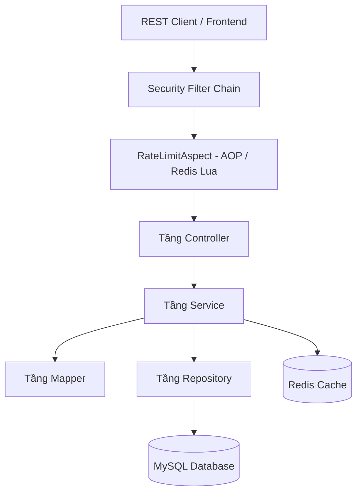
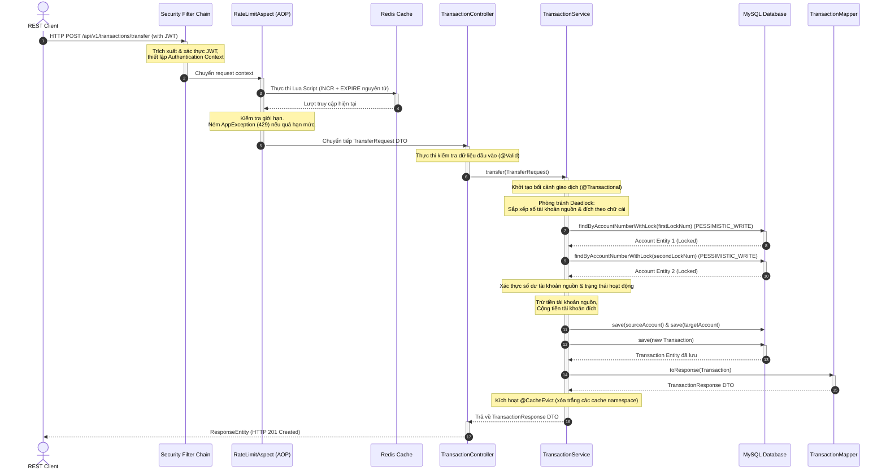

# SmartBank - Codebase Overview & Technical Analysis

Tài liệu này cung cấp một bản phân tích chuyên sâu và tổng quan về cấu trúc mã nguồn, luồng dữ liệu, các công nghệ sử dụng, và các mẫu thiết kế (Design Patterns) áp dụng trong hệ thống **SmartBank**. Phân tích được thực hiện dưới góc nhìn của một Software Architect cao cấp.

---

## 1. High-Level Architecture (Kiến trúc Tổng thể)

Dự án **SmartBank** được xây dựng dựa trên mô hình **Kiến trúc phân tầng / 3 lớp (Layered Architecture)** tiêu chuẩn, kết hợp với cơ chế phân tách các mối bận tâm chung (Cross-Cutting Concerns) thông qua **Aspect-Oriented Programming (AOP)** và các Security Component.



### Cách các thành phần tương tác:
1. **Yêu cầu (Request)** từ Client đi qua chuỗi bộ lọc bảo mật (**Security Filter Chain**), nơi JWT được trích xuất và xác thực.
2. Bộ lọc AOP Aspect (**RateLimitAspect**) can thiệp trước khi request chạm tới controller để thực hiện kiểm tra giới hạn tần suất (Rate Limiting) thông qua Redis.
3. **Tầng Controller** đón nhận các Request DTO đã hợp lệ, phân phối tới **Tầng Service** thích hợp.
4. **Tầng Service** thực thi logic nghiệp vụ ngân hàng (mở tài khoản, chuyển tiền, tính toán số dư). Tầng này quản lý các ranh giới giao dịch cơ sở dữ liệu (`@Transactional`) và tương tác với **Tầng Repository** để đọc/ghi DB.
5. **Tầng Repository** thực thi các câu lệnh SQL (thông qua Spring Data JPA và Hibernate) để thay đổi dữ liệu trong MySQL. Đồng thời, tầng Service sử dụng Redis Cache để tăng tốc độ truy vấn ở các API đọc thông tin ít biến động.

---

## 2. Directory Structure & Component Mapping (Cấu trúc thư mục & Ánh xạ thành phần)

Mã nguồn được tổ chức theo cấu trúc đóng gói theo tầng phân lớp (**packaged-by-layer**):

```text
com.SmartBank
├── config        # Cấu hình hệ thống (Security, Redis)
├── controller    # Các REST Endpoint (Tầng Presentation)
├── dto           # Các DTO phân tách dữ liệu Request/Response
│   ├── request
│   └── response
├── entity        # Thực thể JPA (Tầng Persistence/Model)
│   └── enums
├── exception     # Bộ xử lý ngoại lệ tập trung (Global Exception Handler)
├── mapper        # Lớp ánh xạ DTO <=> JPA Entity
├── repository    # Spring Data JPA Interface (Tầng Data Access)
├── security      # Cấu hình bộ lọc bảo mật, phân quyền SpEL, Rate Limit AOP
└── service       # Lớp thực thi Business Logic chính
```

### Chi tiết trách nhiệm và ví dụ thực tế:

- **`config` (Configuration Package):**
  - *Trách nhiệm:* Cấu hình các Bean hệ thống, cấu hình chuỗi bộ lọc Spring Security, CORS, phân quyền, cấu hình bộ đệm Redis.
  - *Lớp tiêu biểu:* [SecurityConfig.java](file:///d:/SmartBank_Project/SmartBank/src/main/java/com/SmartBank/config/SecurityConfig.java) (cấu hình phân quyền endpoint), [RedisConfig.java](file:///d:/SmartBank_Project/SmartBank/src/main/java/com/SmartBank/config/RedisConfig.java) (cấu hình bộ nhớ đệm).

- **`controller` (Presentation Layer):**
  - *Trách nhiệm:* Nhận HTTP Request, xác thực dữ liệu đầu vào cơ bản (`@Valid`), điều hướng nghiệp vụ xuống tầng Service, trả về HTTP Response.
  - *Lớp tiêu biểu:* [AccountController.java](file:///d:/SmartBank_Project/SmartBank/src/main/java/com/SmartBank/controller/AccountController.java), [TransactionController.java](file:///d:/SmartBank_Project/SmartBank/src/main/java/com/SmartBank/controller/TransactionController.java).

- **`dto` (Data Transfer Objects):**
  - *Trách nhiệm:* Phân tách cấu trúc dữ liệu gửi lên và trả về của API ra khỏi cấu trúc bảng cơ sở dữ liệu (JPA Entities), bảo vệ thông tin nhạy cảm.
  - *Lớp tiêu biểu:* [TransferRequest.java](file:///d:/SmartBank_Project/SmartBank/src/main/java/com/SmartBank/dto/request/TransferRequest.java), [AccountResponse.java](file:///d:/SmartBank_Project/SmartBank/src/main/java/com/SmartBank/dto/response/AccountResponse.java).

- **`entity` (Domain Model / Persistence Layer):**
  - *Trách nhiệm:* Ánh xạ quan hệ thực thể đối tượng sang các bảng quan hệ trong DB (ORM).
  - *Lớp tiêu biểu:* [Customer.java](file:///d:/SmartBank_Project/SmartBank/src/main/java/com/SmartBank/entity/Customer.java), [Account.java](file:///d:/SmartBank_Project/SmartBank/src/main/java/com/SmartBank/entity/Account.java), [Transaction.java](file:///d:/SmartBank_Project/SmartBank/src/main/java/com/SmartBank/entity/Transaction.java).

- **`exception` (Exception Handling):**
  - *Trách nhiệm:* Bắt tất cả các Exception ném ra từ tầng dưới, chuyển đổi thành định dạng JSON chuẩn hóa gửi về Client kèm HTTP Status Code phù hợp.
  - *Lớp tiêu biểu:* [GlobalExceptionHandler.java](file:///d:/SmartBank_Project/SmartBank/src/main/java/com/SmartBank/exception/GlobalExceptionHandler.java), [AppException.java](file:///d:/SmartBank_Project/SmartBank/src/main/java/com/SmartBank/exception/AppException.java).

- **`mapper` (Mapping Layer):**
  - *Trách nhiệm:* Chuyển đổi dữ liệu qua lại giữa Entity và DTO.
  - *Lớp tiêu biểu:* [CustomerMapper.java](file:///d:/SmartBank_Project/SmartBank/src/main/java/com/SmartBank/mapper/CustomerMapper.java), [AccountMapper.java](file:///d:/SmartBank_Project/SmartBank/src/main/java/com/SmartBank/mapper/AccountMapper.java).

- **`repository` (Data Access Layer):**
  - *Trách nhiệm:* Cung cấp các thao tác CRUD và các câu lệnh truy vấn JPA/HQL tương tác trực tiếp với cơ sở dữ liệu.
  - *Lớp tiêu biểu:* [AccountRepository.java](file:///d:/SmartBank_Project/SmartBank/src/main/java/com/SmartBank/repository/AccountRepository.java).

- **`security` (Security & AOP Utility Layer):**
  - *Trách nhiệm:* Xử lý các nghiệp vụ bổ trợ bao gồm xác thực Token, phân quyền động dựa trên SpEL, giới hạn tần suất API thông qua kỹ thuật lập trình khía cạnh (AOP).
  - *Lớp tiêu biểu:* [JwtAuthenticationFilter.java](file:///d:/SmartBank_Project/SmartBank/src/main/java/com/SmartBank/security/JwtAuthenticationFilter.java), [RateLimitAspect.java](file:///d:/SmartBank_Project/SmartBank/src/main/java/com/SmartBank/security/RateLimitAspect.java), [AccountSecurity.java](file:///d:/SmartBank_Project/SmartBank/src/main/java/com/SmartBank/security/AccountSecurity.java).

- **`service` (Business Logic Layer):**
  - *Trách nhiệm:* Xử lý nghiệp vụ chính, bảo vệ toàn vẹn dữ liệu trong các giao dịch, quản lý các kết nối Cache.
  - *Lớp tiêu biểu:* [TransactionService.java](file:///d:/SmartBank_Project/SmartBank/src/main/java/com/SmartBank/service/TransactionService.java), [AccountService.java](file:///d:/SmartBank_Project/SmartBank/src/main/java/com/SmartBank/service/AccountService.java).

---

## 3. Core Data Flow (Luồng Dữ liệu Lõi)

Dưới đây là biểu đồ Sequence Diagram thể hiện chi tiết luồng dữ liệu của một yêu cầu chuyển tiền (`transfer`) trong dự án SmartBank:



---

## 4. Tech Stack & Key Libraries (Công nghệ & Thư viện Lõi)

Hệ thống được phát triển trên các công nghệ Java hiện đại, cấu hình chính ghi nhận trong [pom.xml](file:///d:/SmartBank_Project/SmartBank/pom.xml):

*   **Java 21**: Cung cấp nền tảng runtime hiện đại, tối ưu hiệu năng.
*   **Spring Boot 3.4.4**: Khung ứng dụng chính cung cấp Auto-Configuration, Dependency Injection (IoC/DI).
*   **Spring Security**: Thiết lập bộ lọc và phân quyền API, kết hợp với phương thức bảo vệ bằng annotation `@PreAuthorize`.
*   **Spring Data JPA & Hibernate 6**: Quản lý truy xuất dữ liệu quan hệ ORM, hỗ trợ khóa dữ liệu nâng cao (`@Lock(LockModeType.PESSIMISTIC_WRITE)`).
*   **Spring Data Redis & Cache**: Quản lý kết nối Redis dùng làm bộ đệm và lưu trữ đếm số lượng giới hạn tần suất.
*   **JJWT (io.jsonwebtoken 0.12.6)**: Thư viện tạo, giải mã và xử lý JWT Token.
*   **Lombok**: Tự động sinh mã mẫu (Boilerplate) như Getter, Setter, RequiredConstructor, Builder bằng Annotation Processor.
*   **Spring Boot Starter AOP (AspectJ)**: Hỗ trợ lập trình hướng khía cạnh, cụ thể là can thiệp xử lý tự động giới hạn tần suất request.
*   **Jakarta Validation**: Thực thi kiểm tra dữ liệu qua các annotation như `@NotBlank`, `@Email`, `@Past`, `@Size`.

---

## 5. Design Patterns & Best Practices (Mẫu Thiết kế & Thực tiễn Tốt nhất)

Codebase của dự án áp dụng thành công nhiều Design Pattern kinh điển nhằm tối ưu khả năng mở rộng và bảo trì:

### 1. Design Patterns áp dụng:
*   **Dependency Injection / IoC (Inversion of Control)**: Toàn bộ cấu trúc hệ thống dựa trên nguyên lý Spring Container quản lý vòng đời và tiêm các dependencies tự động (ví dụ: tiêm `AccountRepository` vào `AccountSecurity` và `AccountService`).
*   **Singleton Pattern**: Các Service, Controller, Mapper và Repository được định nghĩa làm các Spring Bean mặc định với phạm vi (Scope) là Singleton nhằm tiết kiệm tài nguyên hệ thống.
*   **Builder Pattern**: Áp dụng rộng rãi trên các Entity và DTO nhờ `@Builder` của Lombok (như [Customer.java](file:///d:/SmartBank_Project/SmartBank/src/main/java/com/SmartBank/entity/Customer.java)), giúp khởi tạo các đối tượng phức tạp một cách rõ ràng và trực quan.
*   **Aspect Pattern (AOP)**: Tách biệt khía cạnh phụ trợ (Rate Limiting) ra khỏi Controller nghiệp vụ nhờ [RateLimitAspect.java](file:///d:/SmartBank_Project/SmartBank/src/main/java/com/SmartBank/security/RateLimitAspect.java).
*   **Pessimistic Locking & Lock Ordering Pattern**: Ngăn ngừa xung đột Lost Update đồng thời áp dụng sắp xếp khóa (Deadlock Avoidance) trong nghiệp vụ chuyển tiền.

### 2. Đánh giá tính tuân thủ Nguyên lý SOLID:

-   **Single Responsibility Principle (SRP - Đơn nhiệm):** Tuân thủ xuất sắc. 
    - `Controller` chỉ làm nhiệm vụ giao tiếp REST.
    - `Service` chỉ tập trung xử lý logic nghiệp vụ.
    - `Repository` chỉ truy xuất cơ sở dữ liệu.
    - `Mapper` chỉ biến đổi kiểu dữ liệu.
    - `AccountSecurity` chỉ đảm nhiệm logic phân quyền truy cập tài khoản.
-   **Open/Closed Principle (OCP - Mở rộng/Đóng kín):** Đạt yêu cầu. Các DTO độc lập cho phép thay đổi cấu trúc dữ liệu trả về của API mà không cần sửa đổi các thực thể Entity dưới DB. Cơ chế Aspect cho phép thêm rate limiting vào bất kỳ API mới nào chỉ bằng cách gắn thêm annotation `@RateLimit` mà không cần sửa mã nguồn logic của nó.
-   **Liskov Substitution Principle (LSP - Thay thế Liskov):** Tuân thủ. Lớp giao diện `JpaRepository` được kế thừa trực tiếp bởi các Interface Repository cụ thể mà không phá vỡ hành vi nguyên bản của Spring Data JPA.
-   **Interface Segregation Principle (ISP - Phân tách Giao diện):** Đạt yêu cầu. Các repository interface của hệ thống (như [CustomerRepository](file:///d:/SmartBank_Project/SmartBank/src/main/java/com/SmartBank/repository/CustomerRepository.java)) chỉ khai báo thêm các phương thức cần thiết cho riêng domain đó, tránh việc phình to giao diện.
-   **Dependency Inversion Principle (DIP - Đảo ngược Phụ thuộc):** Tuân thủ triệt để. Tầng Service phụ thuộc hoàn toàn vào các Interface Repository (ví dụ: `AccountRepository`), cho phép dễ dàng Mocking/Stubbing dữ liệu trong các lớp kiểm thử tự động (Unit Tests) như [CustomerServiceTest.java](file:///d:/SmartBank_Project/SmartBank/src/test/java/com/SmartBank/service/CustomerServiceTest.java).
