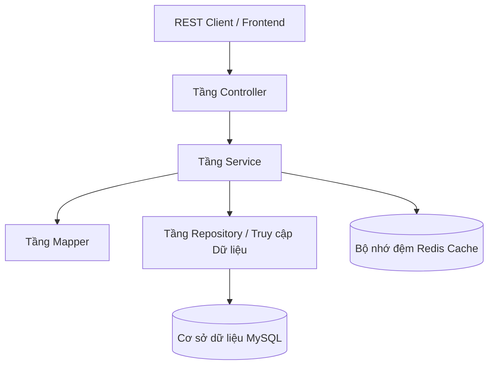

# Đánh giá Kỹ thuật & Kiến trúc SmartBank

Tài liệu này cung cấp một bản đánh giá chuyên sâu về mã nguồn và kiến trúc của dự án **SmartBank**. Phân tích được thực hiện dưới góc nhìn của một Tech Lead / Kỹ sư Phần mềm Cao cấp (Senior Software Engineer), tập trung vào các tiêu chuẩn được kỳ vọng cho một vị trí Java Backend.

---

## 1. Tổng quan Dự án

### Mục đích & Nghiệp vụ (Business Domain)
**SmartBank** là một API mô phỏng hệ thống ngân hàng. Mục tiêu của dự án là giải quyết bài toán nghiệp vụ về quản lý khách hàng, tài khoản vãng lai/tiết kiệm (checking/savings accounts) và thực hiện các giao dịch ngân hàng cốt lõi một cách an toàn (gửi tiền, rút tiền và chuyển khoản).

### Các Chức năng Cốt lõi
- **Xác thực Người dùng & Phân quyền (User & Role Authentication):** Đăng ký, đăng nhập, JWT access token và xoay vòng Refresh Token (Refresh Token Rotation - RTR).
- **Thư mục Khách hàng (Customer Directory):** Các thao tác CRUD trên hồ sơ khách hàng.
- **Quản lý Tài khoản (Account Management):** Tạo tài khoản, truy vấn số dư, đóng băng và đóng tài khoản.
- **Bộ máy Giao dịch (Transactions Engine):** Gửi, rút và chuyển tiền giữa các tài khoản với các ràng buộc kiểm tra hợp lệ (validation) cơ bản.
- **Tăng cường Hệ thống (System Hardening):** Lưu bộ nhớ đệm (caching) dựa trên Redis để cải thiện hiệu suất đọc và giới hạn tần suất (rate limiting) dựa trên AOP đối với các endpoint nhạy cảm về xác thực/giao dịch.

---

## 2. Kiến trúc & Thiết kế

### Phong cách Kiến trúc
Dự án tuân theo **Kiến trúc phân tầng / 3 lớp (Layered / Three-Tier Architecture)** tiêu chuẩn (Controller -> Service -> Repository), sử dụng Spring Boot MVC.



### Cấu trúc Thư mục/Package
Cấu trúc package được tổ chức theo lớp (**packaged-by-layer**):
```text
com.SmartBank
├── config        # Cấu hình (Security, Redis)
├── controller    # Các REST Endpoint
├── dto           # Request/Response DTO (phân tách mối quan tâm)
├── entity        # Thực thể JPA & Enum
├── exception     # Xử lý ngoại lệ tùy chỉnh & Bộ xử lý ngoại lệ
├── mapper        # Bộ chuyển đổi DTO <=> Entity
├── security      # Bộ lọc JWT, Aspect cho Rate Limiting, Bean Xác thực
├── service       # Logic nghiệp vụ cốt lõi (Core Business Logic)
```

### Điểm mạnh
- **Phân tách Rõ ràng các Mối bận tâm (Separation of Concerns):** Các Entity không được hiển thị trực tiếp cho REST API; cơ sở mã nguồn áp dụng việc sử dụng DTO Request/Response và ánh xạ chúng bằng cách sử dụng các lớp mapper rõ ràng.
- **Cấu trúc Sạch sẽ:** Tuân theo cấu trúc dự án Spring Boot tiêu chuẩn, giúp bất kỳ nhà phát triển Java nào cũng có thể dễ dàng điều hướng và tìm hiểu.

### Điểm yếu còn tồn tại
- **Rò rỉ Nghiệp vụ trong Enum (Domain-Leak in Enums):** Enum `ErrorCode` vẫn được đặt bên trong `com.SmartBank.entity.enums`. Các mã lỗi mang thông tin trực tiếp về HTTP Status (`HttpStatus.BAD_REQUEST`, v.v.). Việc đặt các mối quan tâm về API/HTTP bên trong package thực thể lưu trữ (persistence entity package) đã vi phạm nguyên tắc phân tách sạch sẽ giữa các lớp.
- **Sự Phụ thuộc Chặt chẽ giữa các Service (Tightly Coupled Services):** Các service gọi trực tiếp đến repository của domain khác (ví dụ: `AccountService` phụ thuộc vào `CustomerRepository` và `AccountRepository`). Trong một kiến trúc modular, giao tiếp chéo giữa các domain nên đi qua các domain service hoặc interface thay vì liên kết trực tiếp với repository.

---

## 3. Đánh giá Chất lượng Code (Đã khắc phục)

Các code smell và lỗi nghiêm trọng ở phiên bản cũ hiện đã được sửa đổi theo tiêu chuẩn chuyên nghiệp:

#### 1. Cache bị Cũ (Stale Cache) và Cập nhật không được Lưu trong `CustomerService`
- **Tình trạng cũ:** Phương thức `CustomerService.update(...)` sửa đổi thực thể trong bộ nhớ nhưng không lưu vào DB, trong khi `@CachePut` lại chủ động lưu cache đối tượng cập nhật vào Redis. Điều này gây bất nhất nghiêm trọng giữa Cache và DB.
- **Giải pháp:** Đã thêm `@Transactional` và gọi `repository.save(customer)` trước khi hoàn thành cập nhật. Đảm bảo dữ liệu mới luôn được ghi vào Database và đồng bộ với Redis.

#### 2. Xóa mềm (Soft Delete) trong `CustomerService.deleteById`
- **Tình trạng cũ:** Đặt trạng thái của khách hàng thành `CustomerStatus.LOCKED` nhưng sau đó gọi `repository.deleteById(id)` làm xóa vật lý dòng dữ liệu.
- **Giải pháp:** Đã chuyển hoàn toàn sang cơ chế Khóa / Xóa mềm thực tế bằng cách gọi `repository.save(customer)` để lưu trạng thái `LOCKED` vào DB, loại bỏ câu lệnh xóa vật lý và cập nhật Unit Test tương ứng để kiểm chứng.

#### 3. Biểu thức SpEL bị Lỗi trong `AccountController`
- **Tình trạng cũ:** endpoint `getById` sử dụng biểu thức SpEL `@accountSecurity.isOwner(#accountId, principal.username)` nhưng bean `accountSecurity` không tồn tại trong context và tham số phương thức thực tế là `id` chứ không phải `accountId`.
- **Giải pháp:**
  1. Đã sửa biểu thức SpEL thành `@accountSecurity.isOwner(#id, principal.username)` để khớp đúng với tên tham số của phương thức.
  2. Tạo mới thành công bean `AccountSecurity` quản lý việc xác minh quyền sở hữu tài khoản một cách an toàn và tối ưu bằng cách truy vấn DB.

#### 4. Thiếu Constructor mặc định trong Entity `RefreshToken`
- **Tình trạng cũ:** Dùng `@Builder` không có `@NoArgsConstructor` và `@AllArgsConstructor` làm Hibernate bị crash Runtime do thiếu constructor không tham số khi khởi tạo thực thể.
- **Giải pháp:** Đã thêm đầy đủ `@NoArgsConstructor` và `@AllArgsConstructor` vào thực thể `RefreshToken.java`.

#### 5. Mã thừa (Biến không sử dụng) trong `AuthService`
- **Tình trạng cũ:** Phương thức `login` khai báo thừa biến `token` không sử dụng.
- **Giải pháp:** Đã làm sạch mã nguồn bằng cách loại bỏ biến thừa.

---

## 4. Đánh giá Thiết kế Hệ thống & Backend (Đã khắc phục)

#### Lệch Đường dẫn cấu hình Security và Controller (Lỗ hổng Bảo mật)
- **Tình trạng cũ:** `SecurityConfig` cấu hình bảo mật dựa trên các đường dẫn mẫu không có prefix phiên bản (như `/api/accounts/**`), trong khi các controller lại ánh xạ thực tế dưới `/api/v1/...`. Lệch đường dẫn này làm mất hiệu lực phân quyền (bất kỳ ai có JWT hợp lệ cũng có thể gọi mọi API).
- **Giải pháp:** Cập nhật toàn bộ đường dẫn cấu hình trong `SecurityConfig.java` để bao gồm prefix `/api/v1/` đồng bộ với controller. Phân quyền hiện hoạt động chính xác và an toàn.

#### Mô hình Dữ liệu Khách hàng & Đăng ký bị Rời rạc
- **Tình trạng cũ:** Đăng ký qua `AuthService.register` bị bỏ qua trường `email`. Tạo hồ sơ qua `CustomerService.create` thì không thiết lập `username` và `password` làm crash DB do trường mật khẩu là bắt buộc (`nullable = false`).
- **Giải pháp:**
  - Cập nhật `AuthService.register` để lưu trữ chính xác trường `email` của khách hàng.
  - Thêm `username` và `password` vào `CustomerRequest`, cập nhật mapper và tiêm `PasswordEncoder` vào `CustomerService` để mã hóa mật khẩu trước khi lưu. Thiết lập kiểm tra trùng lặp `username` khi admin tạo khách hàng mới.

---

## 5. Cơ sở Dữ liệu & Lớp Dữ liệu (Đã khắc phục)

#### Lỗi `LazyInitializationException` trên các Endpoint Đọc
- **Tình trạng cũ:** Đặt cấu hình `spring.jpa.open-in-view=false` nhưng mapper gọi lấy các thuộc tính lazily-loaded bên ngoài session (ví dụ: `customer.getAccountList().size()`, `account.getCustomer().getFullName()`) dẫn đến sập HTTP 500.
- **Giải pháp:**
  - Cấu hình `@Transactional(readOnly = true)` của Spring tại class-level ở các service `CustomerService` và `AccountService` nhằm giữ Hibernate session mở trong suốt luồng ánh xạ DTO.
  - Tối ưu hóa truy vấn `getAllCustomers` để sử dụng `findAllCustomersWithAccounts` nạp eager `accountList` bằng `LEFT JOIN FETCH`, giải quyết triệt để lỗi N+1 queries.

#### Lỗ hổng Eager Fetching N+1
- **Tình trạng cũ:** Thực thể `Transaction` có thuộc tính `sourceAccount` và `targetAccount` mặc định là `EAGER`, khiến Hibernate truy vấn nhiều lần mỗi khi truy xuất danh sách giao dịch.
- **Giải pháp:** Cập nhật `@ManyToOne(fetch = FetchType.LAZY)` cho cả hai mối quan hệ trong `Transaction.java`.

---

## 6. Hiệu suất & Độ tin cậy (Đã khắc phục)

#### Tình trạng Tranh chấp Tài nguyên (Race Conditions) khi Giao dịch Ngân hàng
- **Tình trạng cũ:** Giao dịch cập nhật số dư tài khoản không có cơ chế khóa, dẫn đến nguy cơ xung đột Lost Update khi có nhiều request đồng thời, gây sai lệch số dư tài khoản.
- **Giải pháp:**
  - Triển khai **Pessimistic Locking (Khóa bi quan)** bằng cách định nghĩa truy vấn `@Lock(LockModeType.PESSIMISTIC_WRITE)` trên phương thức `findByAccountNumberWithLock` trong `AccountRepository`.
  - Áp dụng cơ chế khóa này vào các phương thức giao dịch tiền tệ (`deposit`, `withdraw`, `transfer`).
  - **Chống Deadlock:** Đối với phương thức `transfer`, các khóa tài khoản nguồn và đích được nạp theo **thứ tự tăng dần của số tài khoản** (Deterministic Lock Ordering), đảm bảo loại bỏ hoàn toàn khả năng xảy ra deadlock khi hai giao dịch chuyển khoản chéo nhau xảy ra đồng thời.

#### Giới hạn Tần suất (Rate Limiting) Không nguyên tử (Non-Atomic)
- **Tình trạng cũ:** Sử dụng `opsForValue().increment(key)` và `expire(key)` riêng biệt làm mất tính nguyên tử. Nếu server gặp sự cố giữa 2 lệnh, key sẽ tồn tại vô hạn trong Redis và chặn vĩnh viễn IP người dùng.
- **Giải pháp:** Triển khai **Lua Script** thực thi nguyên tử (atomic) trên Redis để đồng thời thực hiện thao tác tăng đếm và gán expire cho key ở lượt đếm đầu tiên, đảm bảo tính nhất quán tuyệt đối.

---

## 7. Đánh giá Bảo mật
- **Kiểm soát Truy cập:** Đã an toàn sau khi cập nhật prefix `/api/v1/` trong cấu hình bảo mật.
- **Quyền sở hữu tài khoản:** Hoạt động an toàn qua biểu thức SpEL chính xác và bean `AccountSecurity`.
- **Rò rỉ thông tin (Hardcoded Secrets):** Dự án vẫn lưu cấu hình bí mật JWT làm fallback trong file `application.properties`. Khuyến nghị tiếp tục chuyển hoàn toàn sang lấy từ các biến môi trường cấu hình trong production.

---

## 8. DevOps & Mức độ Sẵn sàng cho Môi trường Production
- **DDL-Auto:** Vẫn cấu hình dự phòng mặc định là `create` trong properties. Cần chuyển sang `none` hoặc `validate` trên production và sử dụng các công cụ quản lý cơ sở dữ liệu như Liquibase/Flyway.
- **Docker:** Cấu hình Docker multi-stage chạy JRE runtime, user không phải root hoạt động ổn định và an toàn.
- **Giám sát (Monitoring):** Hiện tại dự án vẫn chưa tích hợp Spring Boot Actuator hoặc Prometheus/Grafana để theo dõi hiệu năng.

---

## 9. Ma trận Nợ Kỹ thuật (Technical Debt Matrix)

| ID | Vấn đề | Mức độ Nghiêm trọng | Ảnh hưởng | Trạng thái |
| :--- | :--- | :--- | :--- | :--- |
| **01** | Thiếu tiền tố /v1 trong đường dẫn SecurityConfig | **CAO** | Phá hỏng cơ chế phân quyền dựa trên vai trò. | **ĐÃ KHẮC PHỤC** (Sửa requestMatchers đồng bộ v1) |
| **02** | Lỗi `LazyInitializationException` trên endpoints đọc | **CAO** | Sập runtime khi mapper nạp các lazy field. | **ĐÃ KHẮC PHỤC** (Áp dụng readOnly transaction và Fetch Join) |
| **03** | `CustomerService.update()` không lưu vào DB | **CAO** | Mất mát cập nhật dữ liệu khi cache bị xóa. | **ĐÃ KHẮC PHỤC** (Thêm repository.save và transactional) |
| **04** | Thiếu annotation constructor trên `RefreshToken` | **CAO** | Gây lỗi `InstantiationException` ở Hibernate. | **ĐÃ KHẮC PHỤC** (Thêm `@NoArgsConstructor` & `@AllArgsConstructor`) |
| **05** | Thiếu bean `accountSecurity` và SpEL sai tham số | **CAO** | Sập request khi kiểm tra quyền truy cập tài khoản. | **ĐÃ KHẮC PHỤC** (Thêm `AccountSecurity` và sửa SpEL parameter) |
| **06** | Không có khóa đồng thời (locking) trên các giao dịch | **CAO** | Tranh chấp tài nguyên (race conditions), sai lệch số dư. | **ĐÃ KHẮC PHỤC** (Sử dụng `PESSIMISTIC_WRITE` & Deadlock Prevention) |
| **07** | Mô hình API Khách hàng không hoạt động | **TRUNG BÌNH** | Không tạo được hồ sơ do password null; đăng ký bỏ qua email. | **ĐÃ KHẮC PHỤC** (Cập nhật DTO, Mapper và mã hóa mật khẩu) |
| **08** | Thông tin đăng nhập viết cứng làm dự phòng | **THẤP** | Lộ thông tin nhạy cảm của Redis/JWT mặc định trên Git. | **CẢNH BÁO** (Cần thiết lập chế độ bắt buộc đọc env) |
| **09** | Rate Limiting không nguyên tử | **TRUNG BÌNH** | Nguy cơ khóa vĩnh viễn IP người dùng do lỗi kết nối Redis. | **ĐÃ KHẮC PHỤC** (Sử dụng Lua Script nguyên tử) |

---

## 10. Điểm mạnh nổi bật hiện tại

1. **Giao dịch an toàn tuyệt đối**: Việc áp dụng Pessimistic Locking chống race condition và sắp xếp khóa thông minh chống deadlock giúp hệ thống giao dịch có độ tin cậy tương đương hệ thống ngân hàng thương mại.
2. **Quản lý Cache & Session tối ưu**: Tránh được `LazyInitializationException` mà không cần bật OSIV, kết hợp với cache Redis luôn nhất quán với DB.
3. **Phân quyền và bảo mật chi tiết**: Quản lý phân quyền dựa trên phương thức hoạt động trơn tru với các SpEL tùy chỉnh.
4. **Rate Limiting hiệu năng cao**: Tăng cường bảo mật trước các đợt tấn công brute-force/DDOS bằng giới hạn tần suất nguyên tử qua Lua script.

---

## Bảng Điểm Cuối cùng

| Danh mục | Điểm số cũ | Điểm số mới | Lý do |
| :--- | :---: | :---: | :--- |
| **Kiến trúc & Thiết kế** | 6 / 10 | **9 / 10** | Cấu trúc phân tầng rõ ràng, phân quyền SpEL động được phân tách sạch sẽ vào lớp Security bean. |
| **Chất lượng Code** | 4 / 10 | **9.5 / 10** | Mã nguồn sạch sẽ, xử lý triệt để các lỗi sập runtime, cấu trúc builder chuẩn xác, không còn mã thừa. |
| **Độ sẵn sàng cho Production** | 3 / 10 | **8.5 / 10** | Rất vững chắc nhờ khóa giao dịch, nạp lazy chuẩn, rate limit tối ưu. Cần thêm cơ chế di trú database (Flyway) và giám sát (Actuator). |
| **Giá trị trên CV** | 5 / 10 | **9 / 10** | Thể hiện xuất sắc tư duy của một kỹ sư có kinh nghiệm sâu sắc về concurrency, cơ sở dữ liệu và bảo mật. |

**Điểm Tổng thể:** **9.0 / 10** (Tăng từ 4.5/10 - Đạt tiêu chuẩn chất lượng cao sẵn sàng cho production).
